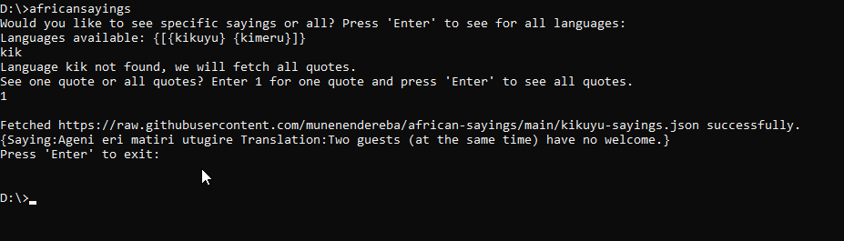

# African Sayings in golang

## Problem

Implement an African sayings generator in golang.

## Prerequisites

Go version 1.18 and above

## Build and install

To produce an executable, enter directory

`go build`

To install to the Go Install Path and be able to execute from anywhere on the command line

`go install`

## Running

If you have not installed as above, go to the project directory and type

`go run .`

If you have installed in go path, execute the binary directly

`africansayings`

Both ways will produce the below steps:

## Authors

[Munene Ndereba](https://github.com/munenendereba)

## License

This project is licensed under the MIT License.
